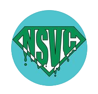
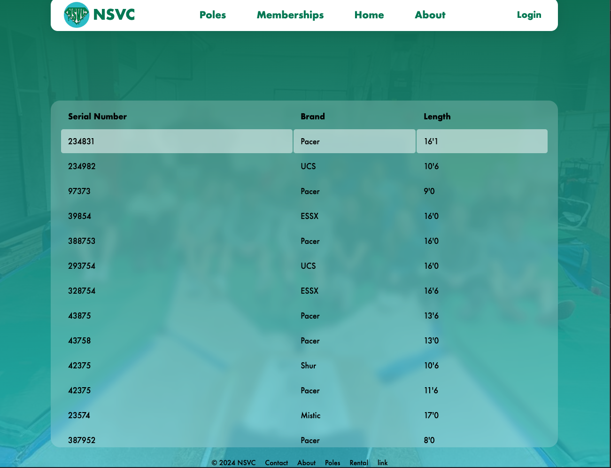
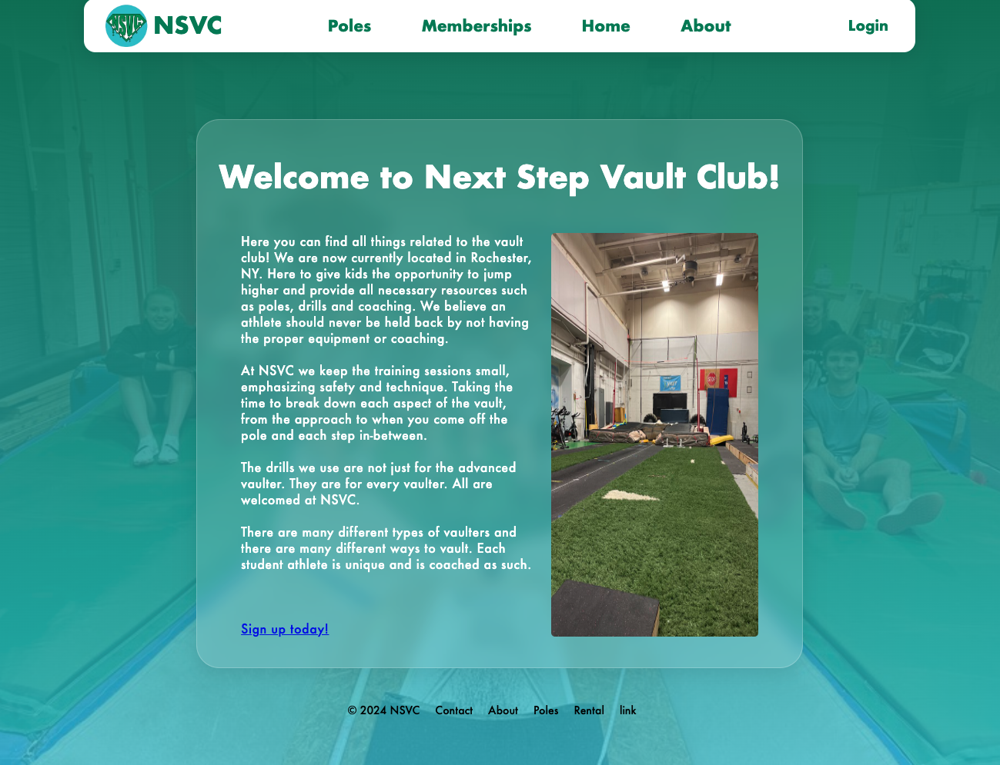
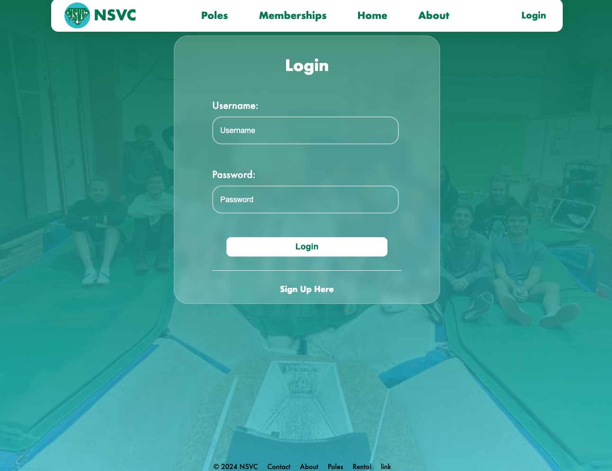

<a id="readme-top"></a>

[![Contributors][contributors-shield]][contributors-url]
[![Forks][forks-shield]][forks-url]
[![Stargazers][stars-shield]][stars-url]
[![Issues][issues-shield]][issues-url]
[![LinkedIn][linkedin-shield]][linkedin-url]


<br />
<div align="center">
  <a href="https://github.com/LostProgrammer1010/NSVC-New-System">
    
  </a>

<h3 align="center">NSVC Website</h3>

  <p align="center">
    This is a new system for a pole vault club. Where pole with store in a inventory sytem with QR codes for each of the poles. To track rentals and inventory of all the poles in the club. The system will replace their current system of memberships and sessions that it will be all in one spot.
    <br />
    <a href="https://github.com/LostProgrammer1010/NSVC-New-System"><strong>Explore the docs »</strong></a>
    <br />
    <br />
    <a href="https://github.com/LostProgrammer1010/NSVC-New-System">View Demo</a>
    ·
    <a href="https://github.com/LostProgrammer1010/NSVC-New-System/issues/new?labels=bug&template=bug-report---.md">Report Bug</a>
    ·
    <a href="https://github.com/LostProgrammer1010/NSVC-New-System/issues/new?labels=enhancement&template=feature-request---.md">Request Feature</a>
  </p>
</div>


<!-- TABLE OF CONTENTS -->
<details>
  <summary>Table of Contents</summary>
  <ol>
    <li>
      <a href="#about-the-project">About The Project</a>
      <ul>
        <li><a href="#built-with">Built With</a></li>
      </ul>
    </li>
    <li>
      <a href="#getting-started">Getting Started</a>
      <ul>
        <li><a href="#prerequisites">Prerequisites</a></li>
        <li><a href="#installation">Installation</a></li>
      </ul>
    </li>
    <li><a href="#usage">Usage</a></li>
    <li><a href="#roadmap">Roadmap</a></li>
    <li><a href="#contributing">Contributing</a></li>
    <li><a href="#license">License</a></li>
    <li><a href="#contact">Contact</a></li>
    <li><a href="#acknowledgments">Acknowledgments</a></li>
  </ol>
</details>


<!-- ABOUT THE PROJECT -->
## About The Project





<p align="right">(<a href="#readme-top">back to top</a>)</p>


### Built With

[![React][React.js]][React-url]
[![Django][Django.py]][Django-url]

<p align="right">(<a href="#readme-top">back to top</a>)</p>


<!-- GETTING STARTED -->
## Getting Started

Setup for the project is pretty simple. All you will need to do is clone the repo and install all dependencies for the project. Then you will have to run the frontend server and backend server at the same time to have them communicate with eachother.

### Prerequisites

You will need to have python install on your computer and npm

For the backend you will need to install all the python libraries that are being used
1. Enter Backend
  ```sh
  cd NSVC-New-System/backend
  ```
2. Install python library from the requrements.txt file
  ```sh
  python3 pip install -r requirements.txt
  ```

For the frontend you will need to install all the react libraries that are being used for the project
1. Enter the frontend
   ```sh
   cd NSVC-New-System/frontend
   ```
2. Install all the javascript packages
  ```sh
  npm install
  ```

### Installation

1. Clone the repo
   ```sh
   git clone https://github.com/LostProgrammer1010/NSVC-New-System.git
   ```
2. Go into frontend directory and Install NPM packages
   ```sh
   npm install
   ```
3. Go into backend directory and install all python package
  ```sh
  python3 pip install -r requirements.txt
  ```
4. Change git remote url to avoid accidental pushes to base project
   ```sh
   git remote set-url origin LostProgrammer1010/NSVC-New-System
   git remote -v # confirm the changes
   ```

<p align="right">(<a href="#readme-top">back to top</a>)</p>


<!-- USAGE EXAMPLES -->
## Usage


<p align="right">(<a href="#readme-top">back to top</a>)</p>


<!-- ROADMAP -->
## Roadmap

- [ ] Register/Login
- [ ] Pole Inventory
  - [ ] Add Poles to Inventory
  - [ ] Remove Poles from Inventory
  - [ ] Update Poles in Inventory
  - [ ] QR code generated for each Pole
    - [ ] QR codes will redirect to website with all information about poles 
- [ ] Rentals Tracking
    - [ ] Add a person to rental for Pole
    - [ ] Time tracking for rentals to see when due
    - [ ] Overdue fee calculations
    - [ ] Update a rental for specific person
    - [ ] Return poles for a rental
    - [ ] Emails notification for rental due dates

### Back Burner Features 
- [ ] Memberships
- [ ] Sessions

See the [open issues](https://github.com/LostProgrammer1010/NSVC-New-System/issues) for a full list of proposed features (and known issues).

<p align="right">(<a href="#readme-top">back to top</a>)</p>


<!-- CONTRIBUTING -->
## Contributing

This is a self driven project and will not allow for Contributions to main product. But feel free to take the code and do as you please with it.

<p align="right">(<a href="#readme-top">back to top</a>)</p>

### Top contributors:

<a href="https://github.com/LostProgrammer1010/NSVC-New-System/graphs/contributors">
  
</a>


<!-- LICENSE -->
## License

Distributed under the MIT License. See `LICENSE.txt` for more information.

<p align="right">(<a href="#readme-top">back to top</a>)</p>


<!-- CONTACT -->
## Contact

Dustin Meyer - [@twitter_handle](https://twitter.com/twitter_handle) - demeyerwork@gmail.com

Project Link: [https://github.com/LostProgrammer1010/NSVC-New-System](https://github.com/LostProgrammer1010/NSVC-New-System)

<p align="right">(<a href="#readme-top">back to top</a>)</p>


<p align="right">(<a href="#readme-top">back to top</a>)</p>


<!-- MARKDOWN LINKS & IMAGES -->
<!-- https://www.markdownguide.org/basic-syntax/#reference-style-links -->
[contributors-shield]: https://img.shields.io/github/contributors/LostProgrammer1010/NSVC-New-System.svg?style=for-the-badge
[contributors-url]: https://github.com/LostProgrammer1010/NSVC-New-System/graphs/contributors
[forks-shield]: https://img.shields.io/github/forks/LostProgrammer1010/NSVC-New-System.svg?style=for-the-badge
[forks-url]: https://github.com/LostProgrammer1010/NSVC-New-System/network/members
[stars-shield]: https://img.shields.io/github/stars/LostProgrammer1010/NSVC-New-System.svg?style=for-the-badge
[stars-url]: https://github.com/LostProgrammer1010/NSVC-New-System/stargazers
[issues-shield]: https://img.shields.io/github/issues/LostProgrammer1010/NSVC-New-System.svg?style=for-the-badge
[issues-url]: https://github.com/LostProgrammer1010/NSVC-New-System/issues
[license-shield]: https://img.shields.io/github/license/LostProgrammer1010/NSVC-New-System.svg?style=for-the-badge
[license-url]: https://github.com/LostProgrammer1010/NSVC-New-System/blob/master/LICENSE.txt
[linkedin-shield]: https://img.shields.io/badge/-LinkedIn-black.svg?style=for-the-badge&logo=linkedin&colorB=555
[linkedin-url]: https://linkedin.com/in/dustin-meyer
[product-screenshot]: images/screenshot.png
[React.js]: https://img.shields.io/badge/React-20232A?style=for-the-badge&logo=react&logoColor=61DAFB
[React-url]: https://reactjs.org/
[Django.py]: https://img.shields.io/badge/Django-092E20?style=for-the-badge&logo=django&logoColor=green
[Django-url]: https://www.djangoproject.com/

